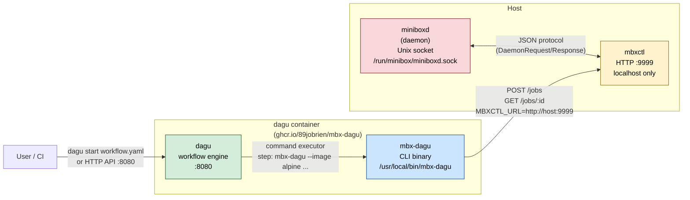

# Dagu + Minibox Integration

Shows how dagu orchestrates minibox container jobs via `mbx-dagu` and the
mbxctl HTTP API.

## Mermaid



## Workflow example

```yaml
# example-workflow.yaml
name: my-pipeline

steps:
  - name: build
    command: mbx-dagu --image rust --tag 1.77 -- cargo build --release

  - name: test
    command: mbx-dagu --image rust --tag 1.77 --env RUST_LOG=debug -- cargo test
    depends:
      - build

  - name: publish
    command: mbx-dagu --image alpine -- /bin/sh -c "echo done"
    depends:
      - test
```

## ASCII (fallback)

```text
  User / CI
      │
      │  dagu start workflow.yaml
      ▼
┌─────────────────────────────────────┐
│  dagu container                     │
│  ┌──────────────┐                   │
│  │  dagu engine │  command executor │
│  │  :8080       ├──────────────────►│
│  └──────────────┘                   │
│                  ┌────────────────┐ │
│                  │  mbx-dagu CLI  │ │
│                  │  --image …     │ │
│                  └───────┬────────┘ │
└──────────────────────────┼──────────┘
                           │  POST /jobs
                           │  GET  /jobs/:id   (poll until done)
                           ▼
                  ┌──────────────────┐
                  │  mbxctl :9999    │
                  │  (localhost)     │
                  └────────┬─────────┘
                           │  DaemonRequest::Run
                           │  (Unix socket)
                           ▼
                  ┌──────────────────┐
                  │  miniboxd        │
                  │  ├── pull image  │
                  │  ├── overlay fs  │
                  │  └── execve      │
                  └──────────────────┘
```

## mbx-dagu CLI reference

```
mbx-dagu [flags] -- <command> [args...]

Flags:
  --image string       Container image name (required)
  --tag string         Image tag (default "latest")
  --env string         Comma-separated KEY=VALUE env vars
  --memory int         Memory limit in bytes (0 = unlimited)
  --cpu-weight int     CPU weight (0 = default)
  --timeout duration   Job timeout (default 1h)
  --mbxctl string      mbxctl base URL (default $MBXCTL_URL or http://localhost:9999)
```

Exit code mirrors the container's exit code — dagu marks the step failed if non-zero.

## Security note

mbxctl binds `localhost:9999` by default. When dagu runs in a container,
set `MBXCTL_URL=http://host-gateway:9999` (Docker) or use a shared network
namespace so the container can reach the host loopback. Never expose mbxctl
on `0.0.0.0` without adding a reverse proxy with authentication first — see
`docs/SECURITY.md` for details.
