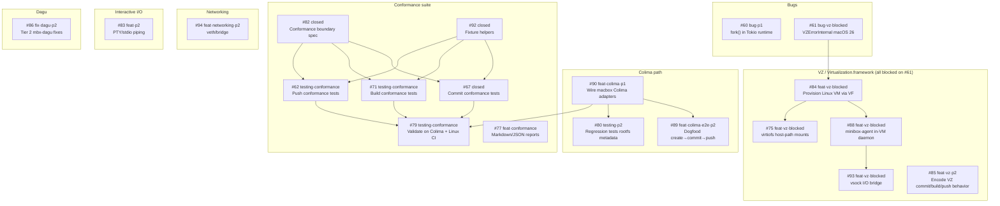

# Issue Dependency Graph

**Generated:** 2026-04-16
**Repo:** 89jobrien/minibox

## Graph

## Critical Paths

| Path             | Next action                                                     |
| ---------------- | --------------------------------------------------------------- |
| **macOS Colima** | `#90` (wire adapters) → `#89` (dogfood) → `#79` (CI validation) |
| **VZ**           | Blocked on `#61` (VZErrorInternal kernel bug — external)        |
| **Conformance**  | `#90` unblocks `#79`; `#71` / `#62` / `#77` independent         |
| **Networking**   | `#94` independent                                               |
| **Bugs**         | `#60` (fork in Tokio) independent, p1                           |

## Independent Work Available Now

- `#60` — fix fork() inside active Tokio runtime (p1)
- `#94` — container networking veth/bridge (p2)
- `#83` — PTY/stdio piping (p2)
- `#86` — mbx-dagu fixes (p2)
- `#71`, `#62`, `#77` — remaining conformance suite items (p2)
