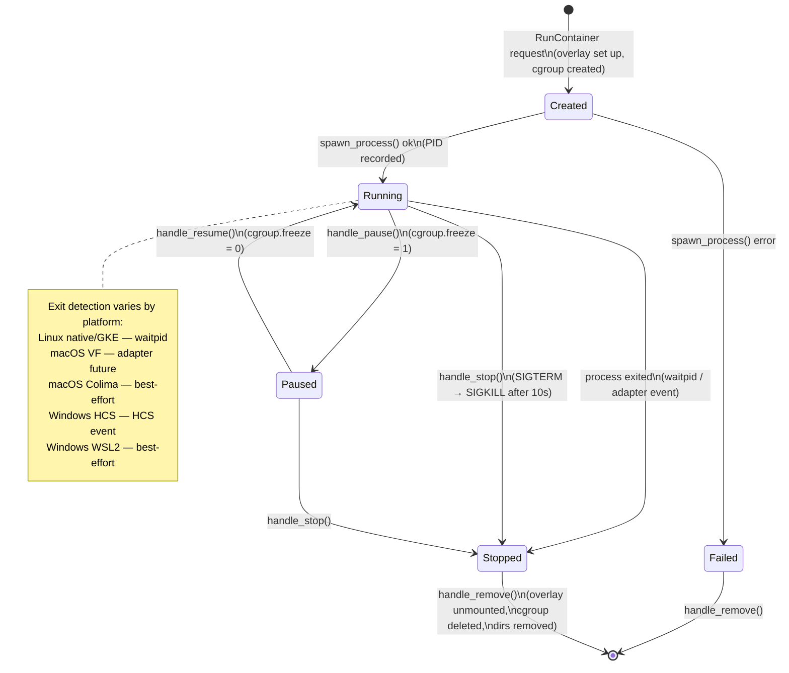

# Container Lifecycle

## Description

The state machine for a single container record in `DaemonState`. State transitions
are driven by daemon events (spawn result, process exit, explicit stop/remove).
State is in-memory only — a daemon restart loses all records.

The `waitpid`-based exit detection works on Linux (native + GKE). On macOS
Virtualization.framework and Windows HCS, container processes run inside a VM or
managed runtime — the daemon detects exit via the adapter's `spawn_process` future
resolving, or via polling the platform runtime API. Colima and WSL2 have known
limitations: exit detection may not fire; containers may linger as "Running" until
manually stopped.

## ASCII

```
             RunContainer request
                     │
                     ▼
               ┌─────────┐
               │ Created │ ◄─── record inserted, overlay/rootfs set up
               └────┬────┘
                    │ spawn_process()
          ┌─────────┴──────────┐
          │ success            │ error
          ▼                    ▼
     ┌─────────┐          ┌────────┐
     │ Running │◄─┐        │ Failed │
     └────┬────┘  │        └───┬────┘
          │       │ ResumeContainer
          │ PauseContainer    │
          ▼       │            │
     ┌─────────┐  │            │
     │ Paused  │──┘            │
     └────┬────┘               │
          │                    │
          │ exit / SIGTERM /   │
          │ SIGKILL / Stopped  │
          ▼                    │
     ┌─────────┐               │
     │ Stopped │◄──────────────┘
     └────┬────┘
          │ Remove request
          ▼
      (record deleted,
       overlay unmounted,
       cgroup cleaned up)
```

## Mermaid


