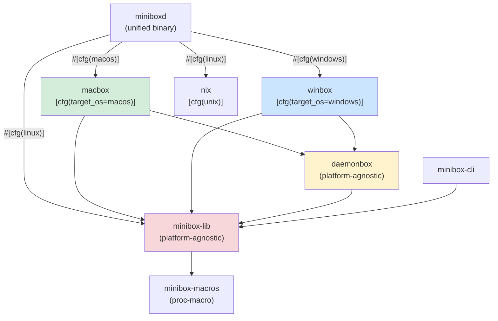

# Crate Dependency Graph

## Description

Shows the workspace crate relationships. Platform-specific dependencies are gated
at compile time — `macbox` is only compiled on macOS, `winbox` only on Windows.
`daemonbox` and `minibox-lib` are platform-agnostic and compiled everywhere.
`minibox-cli` is also platform-agnostic (it only speaks JSON over a socket/pipe).

## ASCII

```
┌─────────────┐  [linux]  ┌───────────────┐
│             ├──────────►│  minibox-lib  │
│             │  [linux]  └───────────────┘
│             ├──────────►  nix
│  miniboxd   │           ┌───────────────┐  ┌────────────┐  ┌───────────────┐
│  (unified   │  [macos]  │    macbox     ├─►│ daemonbox  ├─►│  minibox-lib  │
│   binary)   ├──────────►│               ├─►└────────────┘  └───────────────┘
│             │           └───────────────┘
│             │           ┌───────────────┐  ┌────────────┐  ┌───────────────┐
│             │  [win]    │    winbox     ├─►│ daemonbox  ├─►│  minibox-lib  │
│             ├──────────►│               ├─►└────────────┘  └───────────────┘
└─────────────┘           └───────────────┘

┌─────────────────┐
│   minibox-cli   ├──────────────────────────────────────────►  minibox-lib
└─────────────────┘

┌──────────────────┐
│   minibox-bench  ├─────────────────────────────────────────►  minibox-lib
└──────────────────┘

┌──────────────────┐
│  minibox-macros  │  (proc-macro, used by minibox-lib)
└──────────────────┘
```

## Mermaid


