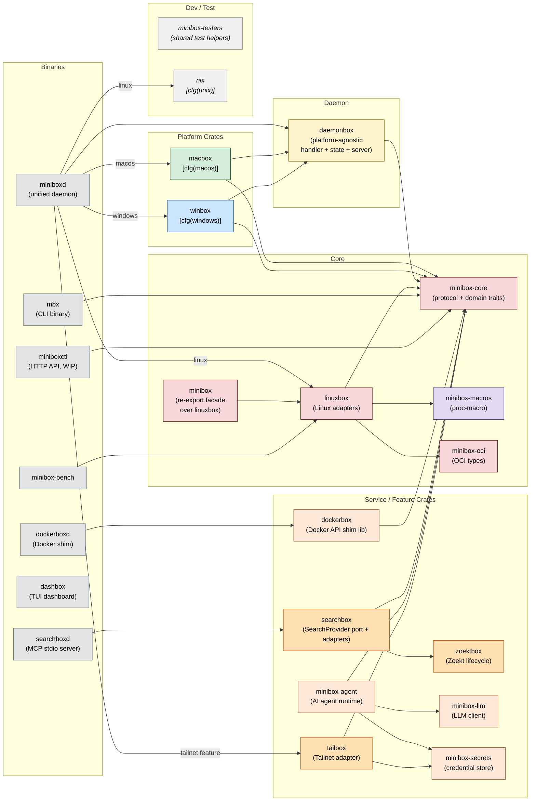

# Crate Dependency Graph

Shows the workspace crate relationships. Platform-specific dependencies are gated at compile
time — `macbox` is only compiled on macOS, `winbox` only on Windows. `daemonbox` and
`minibox-core` are platform-agnostic. `minibox` is a thin re-export facade over `linuxbox`,
which contains the actual Linux adapter implementations. New in 2026-Q2: `searchbox`,
`zoektbox`, `tailbox`, `minibox-agent`, `dashbox`, `dockerbox`, `minibox-secrets`, `minibox-llm`.

## Mermaid



## ASCII

```
BINARIES
  miniboxd ──[linux]──► linuxbox ──► minibox-core
           ──[linux]──► nix
           ──[macos]──► macbox ──► daemonbox ──► minibox-core
           ──[win]────► winbox ──► daemonbox
           ────────────► daemonbox
           ──[tailnet]──► tailbox ──► minibox-secrets ──► minibox-core
  mbx (CLI binary), miniboxctl ───────────────────────► minibox-core
  minibox-bench ──────────────────────────────────────► linuxbox
  dockerboxd ──► dockerbox ──────────────────────────► minibox-core
  searchboxd ──► searchbox ──► zoektbox
                           ──► minibox-core

CORE
  minibox-core  ← canonical protocol + domain traits
  linuxbox      ← Linux adapters (namespaces, cgroups, overlay, OCI)
  minibox       ← thin re-export facade: `pub use linuxbox::*`
  minibox-oci   ← OCI image types
  minibox-macros ← proc-macros (as_any!, adapt!)

SERVICE / FEATURE (2026-Q2 additions marked *)
  searchbox*    ← SearchProvider port + Zoekt/fan-out/fs adapters
  zoektbox*     ← Zoekt binary lifecycle (download, verify, deploy)
  tailbox*      ← Tailnet/Tailscale NetworkProvider adapter
  minibox-agent ← AI agent runtime (wired to crux)
  minibox-llm   ← Multi-provider LLM client
  minibox-secrets ← Credential store (env/keyring/1Password/Bitwarden)
  dockerbox     ← Docker API shim library
```
