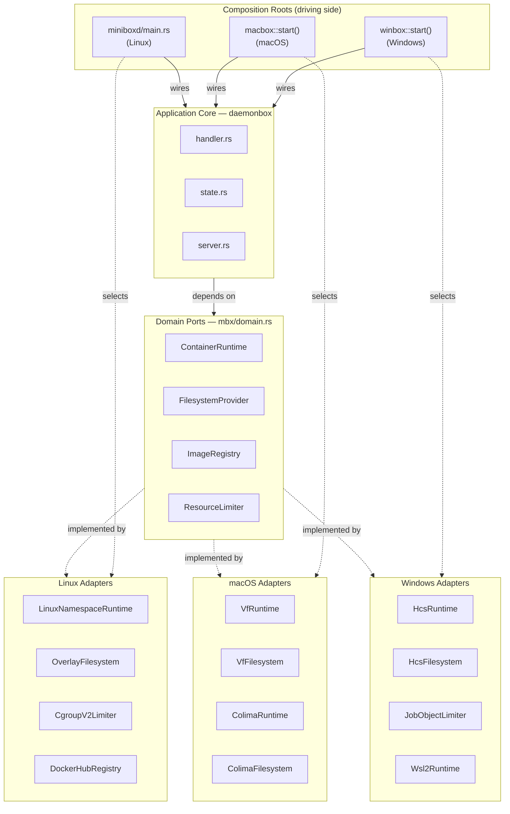

# Hexagonal Architecture

## Description

Minibox uses hexagonal (ports and adapters) architecture. The domain ports
(traits) in `mbx/src/domain.rs` define the interfaces. The application
core in `daemonbox` depends only on those traits — it never imports a concrete
adapter. Composition roots (`miniboxd/main.rs` for Linux, `macbox::start()` for
macOS, `winbox::start()` for Windows) are the only place where concrete adapters
are wired to the application core.

This means the daemon logic (handler, state, server) is fully testable with mock
adapters and has zero platform-specific code.

## ASCII

```
╔═══════════════════════════════════════════════════════════════════╗
║               COMPOSITION ROOTS  (driving side)                   ║
║  miniboxd/main.rs        macbox::start()      winbox::start()     ║
╠═══════════════════════════════════════════════════════════════════╣
║                     APPLICATION CORE                              ║
║                         daemonbox                                 ║
║               handler.rs   state.rs   server.rs                   ║
║          (depends only on domain port traits — no cfg blocks)     ║
╠═══════════════════════════════════════════════════════════════════╣
║                     DOMAIN PORTS                                  ║
║               mbx/src/domain.rs                              ║
║    ContainerRuntime   FilesystemProvider                          ║
║    ImageRegistry      ResourceLimiter                             ║
╠═══════════════════════════════════════════════════════════════════╣
║                     DRIVEN ADAPTERS                               ║
║              mbx/src/adapters/                               ║
║                                                                   ║
║  Linux:    LinuxNamespaceRuntime  OverlayFilesystem               ║
║            CgroupV2Limiter        DockerHubRegistry               ║
║            ProotRuntime           CopyFilesystem   NoopLimiter    ║
║                                                                   ║
║  macOS:    VfRuntime              VfFilesystem       VfRegistry   ║
║            ColimaRuntime          ColimaFilesystem ColimaRegistry ║
║                                                                   ║
║  Windows:  HcsRuntime   HcsFilesystem   HcsRegistry               ║
║            JobObjectLimiter                                       ║
║            Wsl2Runtime  Wsl2Filesystem  Wsl2Registry              ║
╚═══════════════════════════════════════════════════════════════════╝
```

## Mermaid


