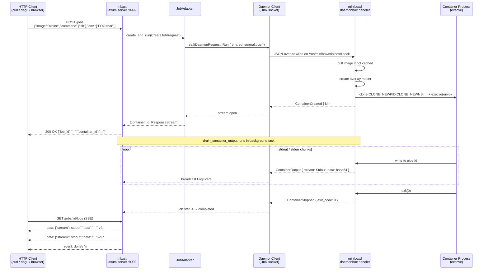

# mbxctl SSE Streaming Pipeline

Shows how a container job request flows from an HTTP client through mbxctl
into the minibox daemon, and how stdout/stderr streams back as Server-Sent Events.

## Mermaid



## ASCII (fallback)

```text
HTTP Client
    │
    │  POST /jobs {"image":…,"env":["FOO=bar"]}
    ▼
┌─────────────────────────────────┐
│  mbxctl (axum :9999)            │
│  ┌────────────────────────────┐ │
│  │  POST /jobs handler        │ │
│  │  JobAdapter.create_and_run │ │
│  └───────────┬────────────────┘ │
└──────────────┼──────────────────┘
               │  DaemonRequest::Run
               │  (JSON / Unix socket)
               ▼
┌──────────────────────────────────────┐
│  miniboxd (daemonbox)                │
│  server.rs → dispatch()              │
│  handler::handle_run_streaming()     │
│  run_inner_capture()                 │
│    ├── pull image                    │
│    ├── overlay mount                 │
│    └── clone + execve(envp)          │
│             │                        │
│         ContainerOutput chunks       │
│         ContainerStopped { code }    │
└──────────────────────────────────────┘
               │
               │  SSE stream
               ▼
HTTP Client ◄── GET /jobs/:id/logs
```

## Key design points

- `drain_container_output` in `mbxctl/src/server.rs` owns the `ResponseStream`
  returned by `JobAdapter::create_and_run` — no stream is dropped prematurely.
- `ContainerOutput` is the only **non-terminal** `DaemonResponse` variant;
  all others (`ContainerStopped`, `Error`, etc.) end the stream.
- `DefaultBodyLimit(1 MB)` is applied to the axum router to prevent request-body DoS.
- mbxctl binds `localhost:9999` by default (systemd unit) — not internet-facing.
