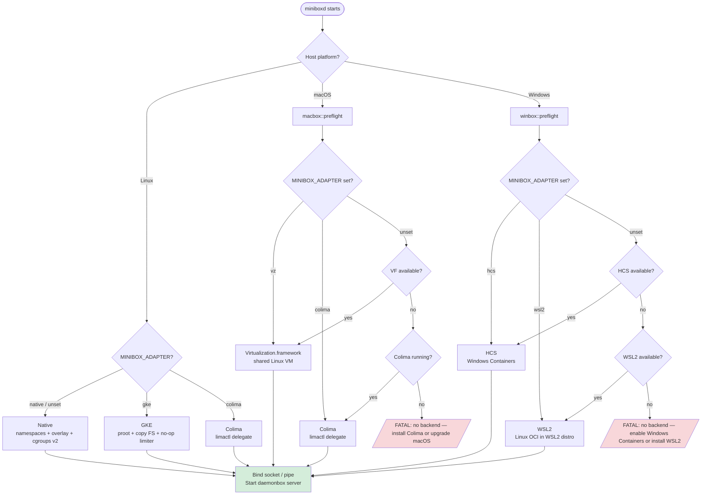

# Platform Adapter Selection

## Description

At startup, `miniboxd` detects the host platform and delegates to the appropriate
platform crate. Within each platform crate, `preflight()` checks which backends
are available and selects one — either via the `MINIBOX_ADAPTER` env var (explicit)
or by capability probing (auto). A fatal error is reported before the socket is
bound if no backend is available.

## ASCII

```
miniboxd starts
      │
      ├─── Linux ──────────────────────────────────────────────┐
      │      │                                                 │
      │    MINIBOX_ADAPTER?                                    │
      │      ├── native (default) → namespaces + cgroups v2    │
      │      ├── gke              → proot + copy FS            │
      │      └── colima           → Colima/limactl delegate    │
      │                                                        │
      ├─── macOS ───────────────────────────────────────────── ┤
      │      │                                                 │
      │    macbox::preflight()                                 │
      │      ├── MINIBOX_ADAPTER=vz  OR  VF available  ───────►│ Virtualization.framework
      │      ├── MINIBOX_ADAPTER=colima  OR  Colima running ──►│ Colima delegate
      │      └── neither ──────────────────────────────────── ►│ FATAL: no backend
      │                                                        │
      └─── Windows ─────────────────────────────────────────── ┘
             │
           winbox::preflight()
             ├── MINIBOX_ADAPTER=hcs   OR  HCS available  ───► HCS (Windows Containers)
             ├── MINIBOX_ADAPTER=wsl2  OR  WSL2 available ───► WSL2 delegate
             └── neither ─────────────────────────────────── ► FATAL: no backend
```

## Mermaid


