# Minibox Architecture Reference

**Date**: 2026-03-26
**Scope**: Comprehensive architecture documentation with Mermaid diagrams for the minibox container runtime
**Companion to**: `2026-03-26-minibox-diagrams.md` (ASCII version)

---

## Table of Contents

1. [System Overview](#1-system-overview)
2. [Crate Dependency Graph](#2-crate-dependency-graph)
3. [Hexagonal Architecture](#3-hexagonal-architecture)
4. [Adapter Suite Selection](#4-adapter-suite-selection)
5. [Container Lifecycle](#5-container-lifecycle)
6. [Image Pull Pipeline](#6-image-pull-pipeline)
7. [Protocol Design](#7-protocol-design)
8. [Container State Machine](#8-container-state-machine)
9. [Overlay Filesystem](#9-overlay-filesystem)
10. [Linux Namespace Isolation](#10-linux-namespace-isolation)
11. [cgroups v2 Resource Control](#11-cgroups-v2-resource-control)
12. [Security Model](#12-security-model)
13. [Async/Sync Boundary](#13-asyncsync-boundary)
14. [Error Propagation](#14-error-propagation)
15. [Runtime Directory Layout](#15-runtime-directory-layout)
16. [Observability & Tracing](#16-observability--tracing)
17. [Platform Dispatch](#17-platform-dispatch)
18. [Testing Strategy](#18-testing-strategy)

---

## 1. System Overview

Minibox is a Docker-like container runtime written in Rust. It uses a daemon/client architecture where `miniboxd` listens on a Unix socket and `minibox` (the CLI) sends JSON commands. Containers are isolated using Linux namespaces, resource-limited via cgroups v2, and run on overlay filesystems built from OCI image layers pulled from Docker Hub or GHCR.

The workspace contains 11 crates organized in three tiers: binary entry points at the top, platform-specific library crates in the middle, and a shared cross-platform core at the bottom. This layering ensures that `miniboxd` compiles on macOS (dispatching to `macbox::start()`) even though full container functionality requires Linux.

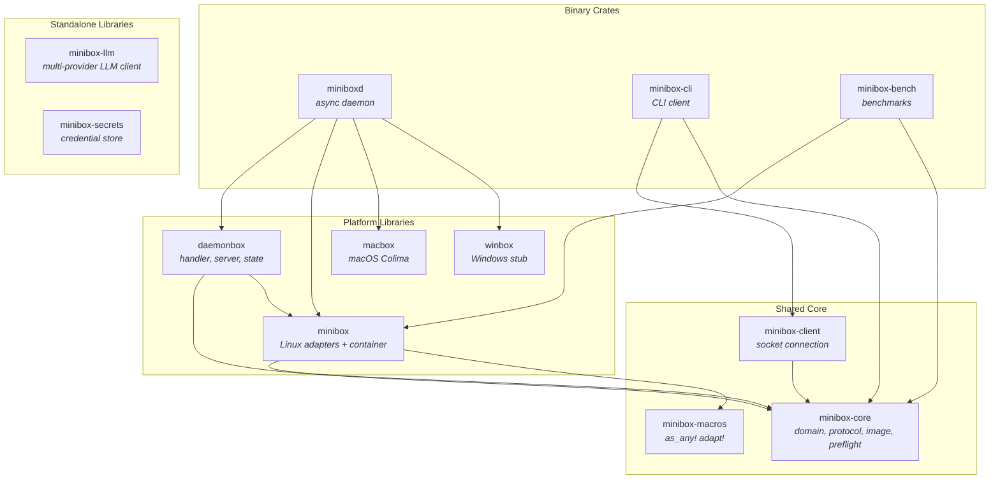

---

## 2. Crate Dependency Graph

Each crate has a specific responsibility. The most important architectural decision is the split between `minibox-core` (cross-platform types) and `minibox` (Linux-specific implementations). minibox re-exports core's `domain`, `image`, and `protocol` modules — this is intentional because the `as_any!` and `adapt!` proc macros expand to `crate::domain::AsAny`, which resolves at the call site (minibox), not the defining crate (minibox-macros).

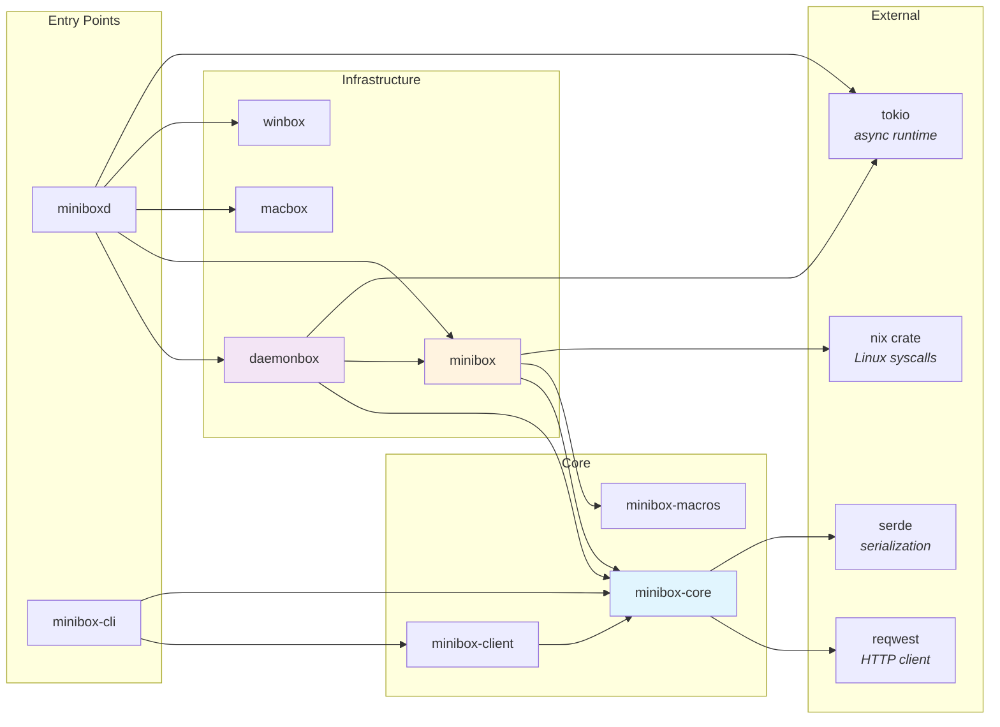

**Key re-export chain**: `minibox` re-exports `minibox_core::{domain, image, protocol}`. This is load-bearing — removing these re-exports breaks macro expansion in every adapter file. The `#[allow(clippy::crate_in_macro_def)]` suppression on `as_any!` is intentional; `crate` in `macro_rules!` resolves at the call site by design.

---

## 3. Hexagonal Architecture

Minibox follows hexagonal (ports and adapters) architecture. Domain traits define the boundary between business logic and infrastructure. The daemon's `main()` function acts as the composition root, wiring concrete adapters into the handler via dependency injection.

This means the handler never calls `mount()` or `clone()` directly — it calls `filesystem.setup_rootfs()` and `runtime.spawn_process()`, which are trait methods. Tests substitute mock adapters (behind the `test-utils` feature flag) that return canned responses without touching the kernel.

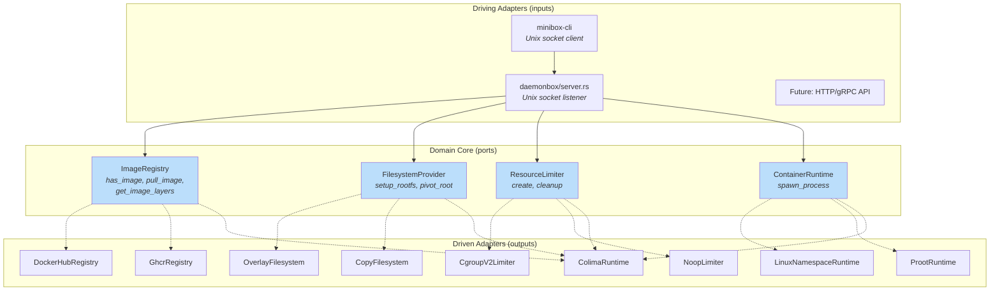

**Domain traits** (defined in `minibox-core/src/domain.rs`):

| Trait                | Methods                                       | Purpose                                |
| -------------------- | --------------------------------------------- | -------------------------------------- |
| `ImageRegistry`      | `has_image`, `pull_image`, `get_image_layers` | Abstract image storage and retrieval   |
| `FilesystemProvider` | `setup_rootfs`, `pivot_root`                  | Abstract container filesystem creation |
| `ResourceLimiter`    | `create`, `cleanup`                           | Abstract resource limit enforcement    |
| `ContainerRuntime`   | `spawn_process`                               | Abstract container process creation    |

---

## 4. Adapter Suite Selection

The `MINIBOX_ADAPTER` environment variable selects which set of adapters to wire at daemon startup. This is a full-suite swap — every trait gets a compatible implementation. The native suite requires root and a Linux kernel with namespace/cgroup/overlay support. The GKE suite runs unprivileged using proot (ptrace-based fake root) and filesystem copies instead of overlay mounts. The Colima suite delegates to Lima/nerdctl on macOS.

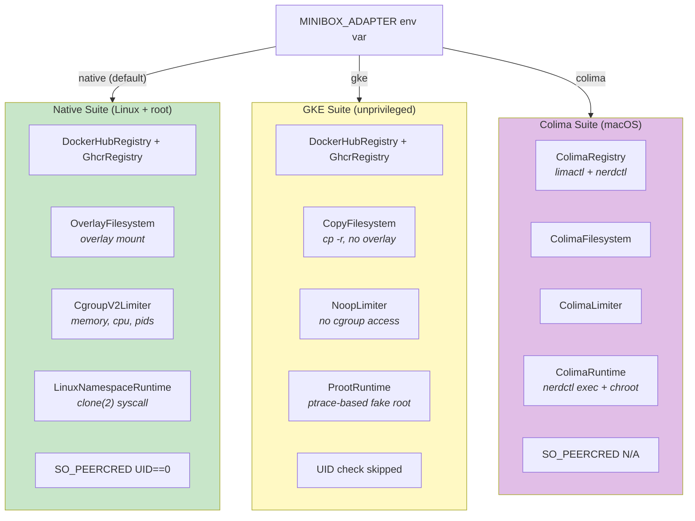

**Library-only adapters** (not yet wired into miniboxd): `docker_desktop`, `wsl2`, `vf` (Virtualization.framework), `hcs` (Windows HCS). These exist as code in `minibox/src/adapters/` but have no entry in the adapter suite selection logic.

---

## 5. Container Lifecycle

This is the most complex flow in the system. A single `minibox run` command triggers image resolution, network pulls, filesystem setup, process isolation, I/O streaming, and cleanup — spanning 5 crates and crossing the async/sync boundary twice.

The key insight is that everything up to and including the `clone()` syscall runs in `tokio::task::spawn_blocking`, because `clone()` cannot be called from an async context (it would block a Tokio worker thread, starving the socket accept loop). After the child is spawned, two more blocking tasks run concurrently: one drains the output pipe, the other waits for the child to exit.

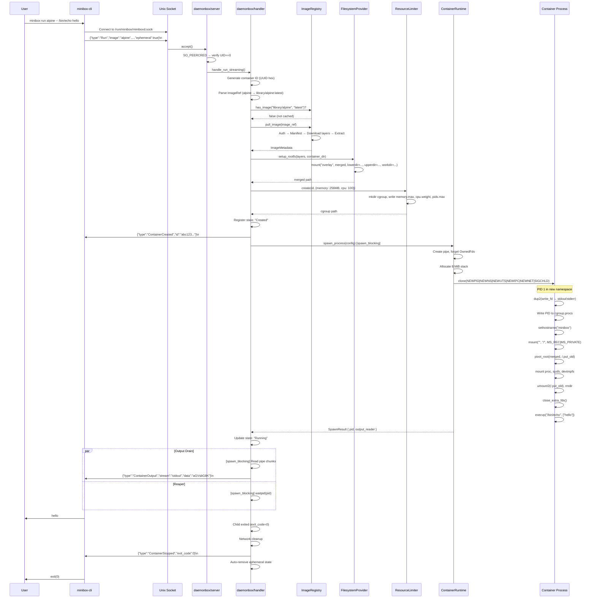

**Critical implementation details:**

- **Pipe FDs across clone()**: Both parent and child get copies of pipe file descriptors after `clone()`. The parent must `std::mem::forget` the `OwnedFd` values before cloning to prevent double-close. The child then `dup2`s the write end into stdout/stderr slots and closes both raw FDs. The parent closes the write end after clone returns, keeping only the read end for output streaming.

- **pivot_root requires MS_PRIVATE**: After `CLONE_NEWNS`, the child inherits shared mount propagation from the parent. `pivot_root` fails with EINVAL unless `mount("", "/", MS_REC|MS_PRIVATE)` is called first inside the child.

- **close_extra_fds uses close_range fast path**: Tries `close_range(3, ~0U, 0)` first (kernel 5.9+), falls back to `/proc/self/fd` iteration. The fallback must collect FD numbers into a Vec before closing, because closing during iteration would close `ReadDir`'s own FD.

---

## 6. Image Pull Pipeline

Image pulls follow the OCI distribution spec. Authentication is anonymous for public images (Docker Hub returns a short-lived bearer token). The manifest declares layer digests and sizes; each layer is a gzipped tar archive that gets security-validated during extraction.

The security validation in `layer.rs` is one of the most critical code paths in the system. It prevents Zip Slip attacks (path traversal via `../`), host path leakage (absolute symlinks surviving pivot_root), privilege escalation (setuid binaries in image layers), and device node injection.

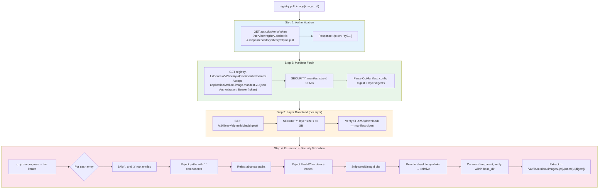

**Absolute symlink rewriting** deserves special attention. OCI layers contain symlinks like `/bin/sh → /bin/busybox`. After `pivot_root`, these absolute paths would reference the container's own root, which is correct at runtime. But during extraction to the host filesystem, `strip_prefix("/")` gives a path relative to the extraction root, not the symlink's parent directory. The `relative_path(entry_dir, abs_target)` function computes the correct relative target (e.g., `busybox` when both are in `bin/`), preventing broken symlinks like `/bin/bin/busybox`.

---

## 7. Protocol Design

Minibox uses a newline-delimited JSON protocol over a Unix domain socket. Each message is a single JSON object terminated by `\n`, using serde's `#[serde(tag = "type")]` for tagged enum dispatch. This is intentionally simple — no framing, no length prefix, no binary protocol. The maximum request size is 1 MB.

For ephemeral containers (`ephemeral: true`), the protocol becomes a streaming channel: the daemon sends `ContainerCreated` once, then streams `ContainerOutput` messages (with base64-encoded stdout/stderr chunks) in real time, and finally sends `ContainerStopped` with the exit code. The CLI exits with the container's exit code.

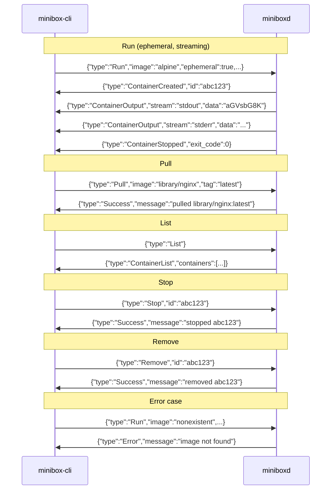

**Request types** (`DaemonRequest` enum):

| Variant  | Fields                                                                                | Description                                      |
| -------- | ------------------------------------------------------------------------------------- | ------------------------------------------------ |
| `Run`    | `image`, `tag`, `command`, `memory_limit_bytes`, `cpu_weight`, `ephemeral`, `network` | Create and start a container                     |
| `Pull`   | `image`, `tag`                                                                        | Download an image without running                |
| `Stop`   | `id`                                                                                  | Send SIGTERM then SIGKILL to a running container |
| `Remove` | `id`                                                                                  | Clean up a stopped container's resources         |
| `List`   | (none)                                                                                | List all tracked containers                      |

**Response types** (`DaemonResponse` enum):

| Variant            | Fields                                    | Description                                     |
| ------------------ | ----------------------------------------- | ----------------------------------------------- |
| `ContainerCreated` | `id`                                      | Container created, process about to spawn       |
| `ContainerOutput`  | `stream` (Stdout/Stderr), `data` (base64) | Real-time output chunk from ephemeral container |
| `ContainerStopped` | `exit_code`                               | Container process exited                        |
| `ContainerList`    | `containers: Vec<ContainerInfo>`          | All tracked containers                          |
| `Success`          | `message`                                 | Generic success acknowledgment                  |
| `Error`            | `message`                                 | Operation failed                                |

---

## 8. Container State Machine

Container state is tracked in-memory by `DaemonState` (a `HashMap<String, ContainerRecord>` behind a Tokio `RwLock`). State is persisted to `state.json` after every mutation, but the daemon does not recover in-flight containers on restart — PID tracking is lost, and orphaned containers are not cleaned up.

Ephemeral containers (the default for `minibox run`) skip the Stop/Remove lifecycle entirely — they auto-remove after the child process exits.

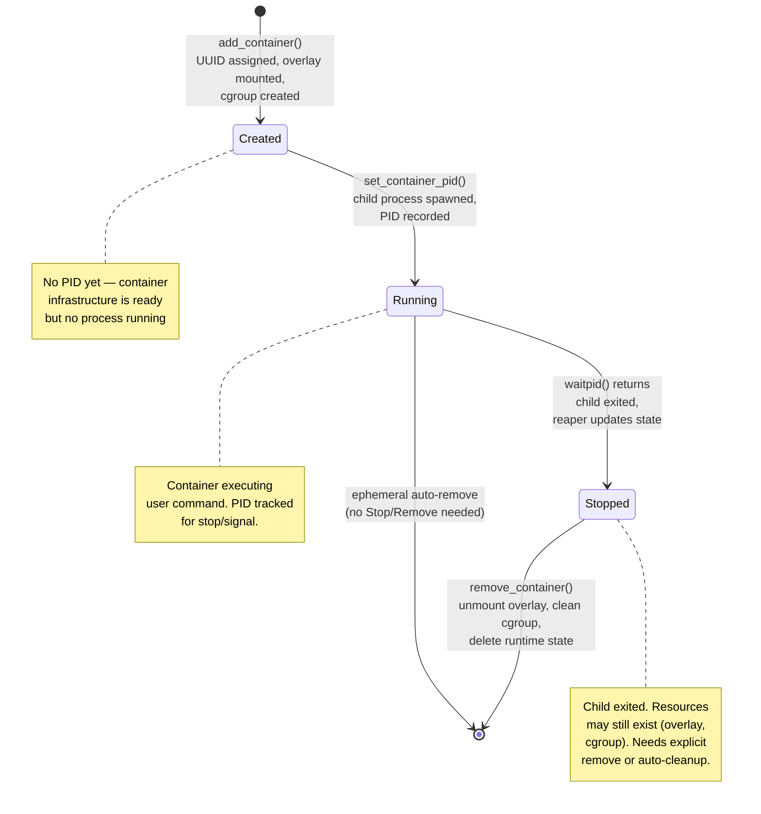

**ContainerRecord** fields:

| Field             | Type          | Description                 |
| ----------------- | ------------- | --------------------------- |
| `info.id`         | `String`      | 16-character UUID hex       |
| `info.image`      | `String`      | `image:tag`                 |
| `info.command`    | `String`      | Space-separated command     |
| `info.state`      | `String`      | Created / Running / Stopped |
| `info.created_at` | `String`      | ISO 8601 timestamp          |
| `info.pid`        | `Option<u32>` | Host PID (set when Running) |
| `rootfs_path`     | `PathBuf`     | Overlay merged dir          |
| `cgroup_path`     | `PathBuf`     | cgroup v2 dir               |

---

## 9. Overlay Filesystem

Each container gets a layered filesystem built from OCI image layers (read-only) with a writable upper directory. Linux overlay filesystem unions these into a single view. The container sees a normal root filesystem; writes go to the upper layer without modifying image layers (copy-on-write semantics).

Mount flags include `MS_NOSUID` and `MS_NODEV` to prevent privilege escalation via setuid binaries or device nodes in the writable layer. After pivot_root, `/sys` is mounted read-only to prevent the container from manipulating cgroup controls.

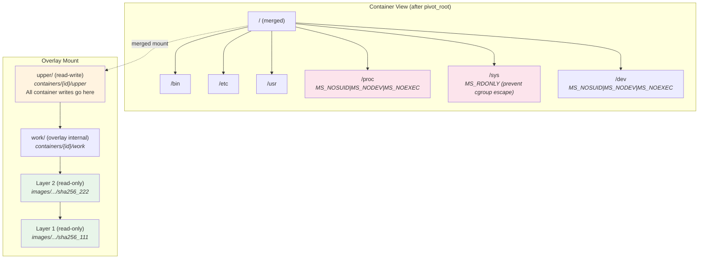

**Mount command equivalent:**

```
mount -t overlay overlay \
  -o lowerdir=layer2:layer1,upperdir=upper,workdir=work \
  -o nosuid,nodev \
  merged/
```

**Cleanup sequence on container remove:**

1. `umount2(merged, MNT_DETACH)` — detach overlay mount
2. `rm -rf /var/lib/minibox/containers/{id}/` — delete upper/work/merged dirs
3. `rm -rf /sys/fs/cgroup/minibox/{id}/` — delete cgroup directory

---

## 10. Linux Namespace Isolation

The `clone()` syscall creates the container process in five new namespaces simultaneously. Each namespace provides a different dimension of isolation. The child process is PID 1 in its namespace (the init process), which has special signal handling semantics.

The 8 MiB stack is heap-allocated (not the thread stack) because `clone()` requires an explicit stack pointer for the child. A C-calling-convention trampoline function unwraps a Rust closure from a raw pointer and calls it — this is the bridge between the C `clone()` API and Rust's closure-based abstraction.

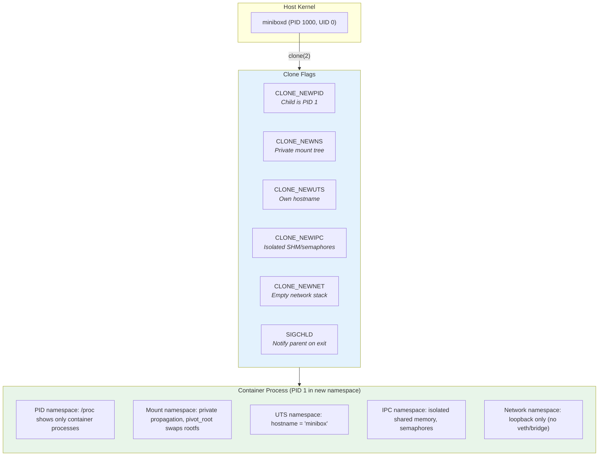

**What each namespace isolates:**

| Namespace | Flag           | Isolation                                                                     |
| --------- | -------------- | ----------------------------------------------------------------------------- |
| PID       | `CLONE_NEWPID` | Process ID space. Container's PID 1 only sees its own descendants in `/proc`. |
| Mount     | `CLONE_NEWNS`  | Mount table. After `pivot_root`, the host filesystem is invisible.            |
| UTS       | `CLONE_NEWUTS` | Hostname and NIS domain. Container gets hostname "minibox".                   |
| IPC       | `CLONE_NEWIPC` | System V IPC, POSIX message queues. No cross-container shared memory.         |
| Network   | `CLONE_NEWNET` | Network interfaces, routing tables, iptables. Only loopback available.        |

**Missing namespaces** (potential future work):

- **User namespace** (`CLONE_NEWUSER`): Would enable rootless containers by mapping UID 0 inside to an unprivileged UID outside.
- **Cgroup namespace** (`CLONE_NEWCGROUP`): Would virtualize `/sys/fs/cgroup` so the container sees itself as the cgroup root.

---

## 11. cgroups v2 Resource Control

Minibox uses cgroups v2 (unified hierarchy) for resource limits. Each container gets its own cgroup directory under the minibox slice. The daemon moves itself into a `supervisor/` leaf cgroup at startup to comply with the "no internal process" rule — a cgroup v2 constraint that forbids a cgroup from simultaneously containing processes and child cgroups.

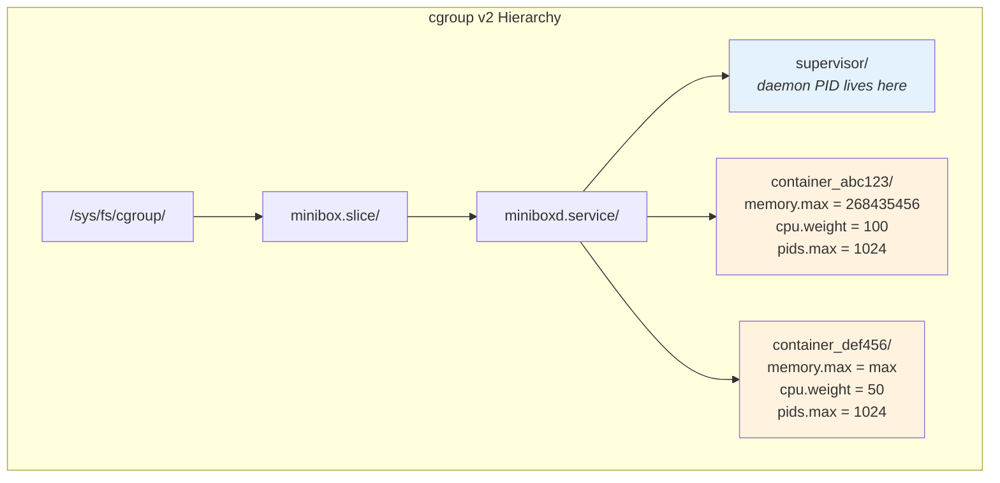

**Resource controls per container:**

| File         | Default              | Description                                                  |
| ------------ | -------------------- | ------------------------------------------------------------ |
| `memory.max` | `max` (unlimited)    | Hard memory limit. Kernel OOM-kills on breach.               |
| `cpu.weight` | `100`                | Relative CPU share (1–10000). Only matters under contention. |
| `pids.max`   | `1024`               | Maximum process count. Prevents fork bombs.                  |
| `io.max`     | (not set by default) | Block I/O limits. Requires real block device `MAJOR:MINOR`.  |

**Gotchas:**

- `io.max` requires the `MAJOR:MINOR` of a real block device. In Colima VMs, the virtio disk is `253:0` (vda), not `8:0` (sda). Use `find_first_block_device()` which reads `/sys/block/*/dev`.
- PID 0 is silently accepted by kernel 6.8 when written to `cgroup.procs`, but it's never valid. Minibox validates explicitly before writing.
- The "no internal process" rule is enforced by cgroup v2: if the daemon's PID is in `miniboxd.service/cgroup.procs`, container cgroup creation under `miniboxd.service/` fails. The `supervisor/` leaf cgroup solves this.

---

## 12. Security Model

Minibox's security model operates at four boundaries: the network (image pulls), the filesystem (tar extraction), the socket (client authentication), and the container (kernel isolation). Each boundary has specific defenses.

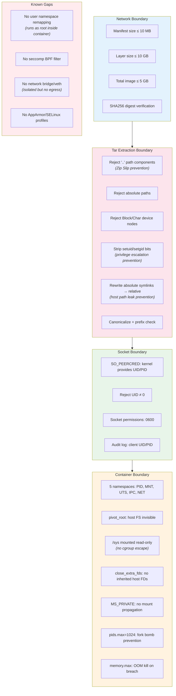

**Threat model summary:**

| Threat                          | Mitigation                                    | Location                   |
| ------------------------------- | --------------------------------------------- | -------------------------- |
| Path traversal (Zip Slip)       | Reject `..`, canonicalize, prefix check       | `layer.rs`                 |
| Absolute symlink host leak      | Rewrite to relative path                      | `layer.rs:relative_path()` |
| Device node injection           | Reject Block/Char entry types                 | `layer.rs`                 |
| Privilege escalation via setuid | Strip setuid/setgid bits from extracted files | `layer.rs`                 |
| Unauthorized daemon access      | SO_PEERCRED UID==0 check                      | `server.rs`                |
| Cgroup escape                   | /sys mounted read-only                        | `filesystem.rs`            |
| Fork bomb                       | pids.max=1024                                 | `cgroups.rs`               |
| Memory exhaustion               | memory.max enforcement                        | `cgroups.rs`               |
| Host FD leak to container       | close_range(3, ~0U) or /proc/self/fd scan     | `process.rs`               |
| Mount propagation escape        | MS_REC\|MS_PRIVATE before pivot_root          | `filesystem.rs`            |

---

## 13. Async/Sync Boundary

The daemon uses Tokio for async I/O (socket accept, read, write, HTTP requests) but container operations involve blocking Linux syscalls that cannot run in an async context. The `tokio::task::spawn_blocking` function bridges this gap by offloading blocking work to a dedicated thread pool.

This is a non-negotiable architectural rule: **clone/fork/exec, mount/umount, waitpid, and file I/O from pipes must always run in spawn_blocking**. Violating this starves the Tokio worker threads, causing the socket accept loop to hang and all clients to time out.

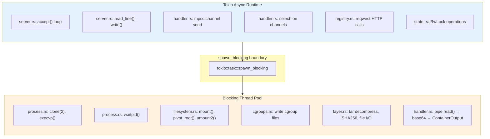

**Why this matters in practice:** A single `clone()` call that blocks a Tokio worker for 50ms is enough to delay all pending socket accepts. With 4 worker threads and 4 concurrent container creations, the entire daemon becomes unresponsive. The `spawn_semaphore` (max 100 concurrent spawns) provides backpressure on top of this.

---

## 14. Error Propagation

Errors propagate differently depending on where they originate. Infrastructure failures (overlay mount, cgroup creation, image pull) are caught by the handler's `?` operator, trigger cleanup, and result in `DaemonResponse::Error` sent to the client. Child process failures (exec not found, pivot_root failure) can only communicate via the exit code (127 by convention) because the child is in a forked process with no direct error channel back to the parent.

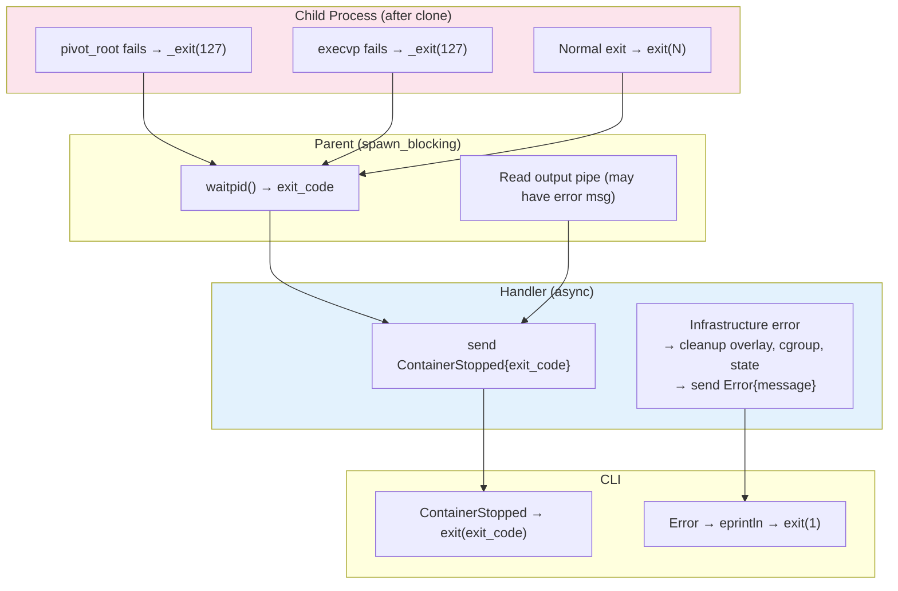

**Error handling conventions:**

- Every fallible operation uses `.context("description")?` (anyhow)
- No `.unwrap()` in production code — panics would crash all running containers
- Cleanup failures are logged at `warn!` level but don't propagate (best-effort cleanup)
- The handler catches all errors before they reach the socket write, converting them to `DaemonResponse::Error`

---

## 15. Runtime Directory Layout

Minibox uses three directory trees: runtime state, persistent storage, and cgroup control files. All paths are configurable via environment variables for testing and non-standard deployments.

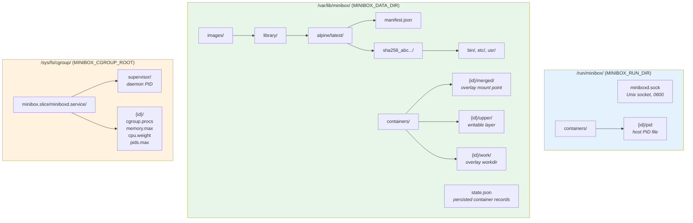

**Environment variable overrides:**

| Variable               | Default (root)           | Default (non-root)  | Description                 |
| ---------------------- | ------------------------ | ------------------- | --------------------------- |
| `MINIBOX_DATA_DIR`     | `/var/lib/minibox`       | `~/.minibox/cache/` | Image and container storage |
| `MINIBOX_RUN_DIR`      | `/run/minibox`           | `/run/minibox`      | Socket and runtime state    |
| `MINIBOX_SOCKET_PATH`  | `$RUN_DIR/miniboxd.sock` | —                   | Unix socket path            |
| `MINIBOX_CGROUP_ROOT`  | `/sys/fs/cgroup/minibox` | —                   | cgroup root for containers  |
| `MINIBOX_SOCKET_MODE`  | `0600`                   | —                   | Socket file permissions     |
| `MINIBOX_SOCKET_GROUP` | (none)                   | —                   | Socket group ownership      |

---

## 16. Observability & Tracing

Minibox uses the `tracing` crate for structured logging. Events follow a strict convention: severity is disciplined (no `warn!` for normal operations), messages use `"subsystem: verb noun"` format, and structured data goes in key-value fields (never interpolated into the message string). This makes logs machine-queryable while remaining human-readable.

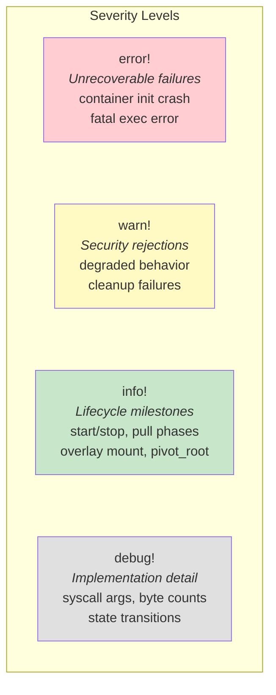

**Correct usage:**

```rust
tracing::info!(
    container_id = %id,
    pid = pid.as_raw(),
    rootfs = %config.rootfs.display(),
    "container: process started"     // subsystem: verb noun
);
```

**Wrong usage:**

```rust
// Values embedded in message — not queryable by log aggregators
tracing::info!("Container {} started with PID {}", id, pid);
```

**Canonical structured fields:**

| Field                         | Type          | Context                         |
| ----------------------------- | ------------- | ------------------------------- |
| `container_id`                | `&str`        | All container operations        |
| `pid` / `child_pid`           | `u32` / `i32` | Process lifecycle, clone result |
| `clone_flags`                 | `i32`         | namespace.rs                    |
| `entry`                       | `&Path`       | Tar security events             |
| `kind`                        | `&EntryType`  | Device node rejection           |
| `target` / `rewritten_target` | `&Path`       | Symlink rewrite events          |
| `new_root`                    | `&Path`       | pivot_root destination          |
| `fds_closed`                  | `usize`       | close_extra_fds count           |
| `command`                     | `&str`        | Container entrypoint            |
| `rootfs`                      | `&Path`       | Container rootfs path           |
| `mode_before` / `mode_after`  | `u32`         | Permission bit changes (octal)  |

---

## 17. Platform Dispatch

The `miniboxd` binary compiles on all platforms. On Linux, it runs the full daemon. On macOS, it delegates to `macbox::start()` which uses Colima (a Lima-based container VM). On Windows, it delegates to `winbox::start()` (currently a stub). This dispatch happens at compile time via `#[cfg(target_os)]` attributes.

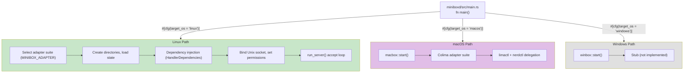

**Compile gate convention:**

- `#[cfg(target_os = "linux")]` — Linux-only: container module (namespaces, cgroups, overlay, process)
- `#[cfg(unix)]` — Unix-wide: preflight checks, signal handling, socket permissions
- `#[cfg(test)]` — Test fixtures, mock adapters

**Platform crate naming**: `{platform}box` — `minibox`, `macbox`, `winbox`. This convention should be followed for future platforms.

---

## 18. Testing Strategy

Minibox uses a four-tier testing pyramid. Unit tests run anywhere (including macOS CI). Integration and E2E tests require a Linux host with root access and kernel features (cgroups v2, overlay, namespaces). Property-based tests use proptest to fuzz protocol serialization, state machine transitions, and handler edge cases.

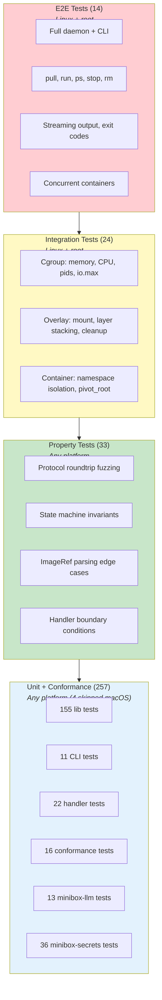

**Test commands:**

| Command                                        | Platform     | What it runs                            |
| ---------------------------------------------- | ------------ | --------------------------------------- |
| `cargo xtask test-unit` / `just test-unit`     | Any          | Unit + conformance (257 tests)          |
| `cargo xtask test-property`                    | Any          | Proptest property tests (33 tests)      |
| `just test-integration`                        | Linux + root | Cgroup + overlay integration (24 tests) |
| `just test-e2e` / `cargo xtask test-e2e-suite` | Linux + root | Full daemon + CLI (14 tests)            |
| `cargo xtask pre-commit`                       | macOS-safe   | fmt-check + clippy + release build      |
| `cargo xtask prepush`                          | Any          | nextest + llvm-cov coverage             |

**macOS quality gates** (run in CI on `macos-latest`):

```
cargo fmt --all --check
cargo clippy -p minibox -p minibox-macros -p minibox-cli -p daemonbox -p macbox -p miniboxd -- -D warnings
cargo xtask test-unit
```

**Testing gotchas:**

- `std::env::set_var`/`remove_var` are `unsafe` in Rust 2024 — wrap in `unsafe {}` and serialize with a `static Mutex<()>` guard
- Proptest `FileFailurePersistence` warning in integration tests — suppress with `failure_persistence: None`
- `DaemonState` fixture requires `ImageStore::new(tmp.join("images"))` + a `data_dir` path
- `CgroupManager::create()` runs `create_dir_all` before bounds checks — proptest cgroup tests need a real cgroup2 mount and root
